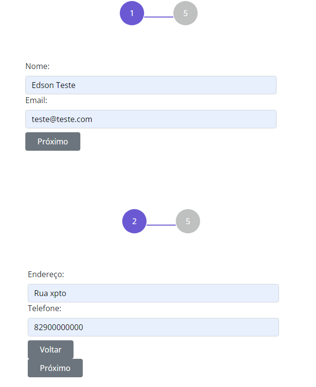

	

## Meu projeto

Projeto inicial é apenas montar um formulário de multiplos passos para resolver uma necessidade pontual no trabalho.

No primeiro momento esse formulário tera foco apenas na fucionalidade pois é o objetivo principal, pois o design vai variar dependedo da necessidade.

Mas no futuro será implementado um layout completo para que se possa ser usado por qualquer pessoa.

### Tecnologias usadas:

- JQuery, para fazer as funcionalidades de passar as partes do formulário.
  me familiarizei com o JQuery com esse pequeno projeto.

- CSS, para implementar as visualizações das cores de marcação dos passos. Esse código acabei pegando pronto e ajustando as minhas necessidades. Mas falta refatorar, pois o código não está seguindo nem um padrão e pretendo manter o BEM como padrão de nomenclatura.
